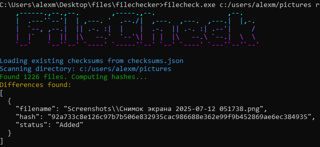

# File checker
This is a simple implementation of file checks using sha hash algorithm.
* UTF-8 support
* Recursive search
* File statuses

## File statuses
Currently this program supports 5 status types.
1. Added
2. Removed
3. Renamed
4. Moved
5. Modified

## Usage
Usage: `filecheck.exe <pathToDir> <mode>`  
### pathToDir: `Path to check directory`  
### mode: `r` or `w` 
- **r**: Read all files in directory and compare it with old hashes stored in `checksums.json` 
- **w**: Write all hashes of files to `checksums.json`

## Used dependecies
- SHA algorithm **[picosha2](https://github.com/okdshin/PicoSHA2)** 
- JSON C++ **[nlohmann/json](https://github.com/nlohmann/json)** 